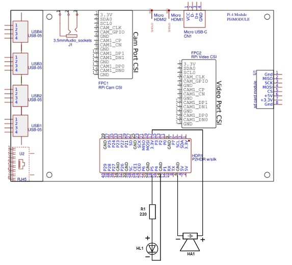
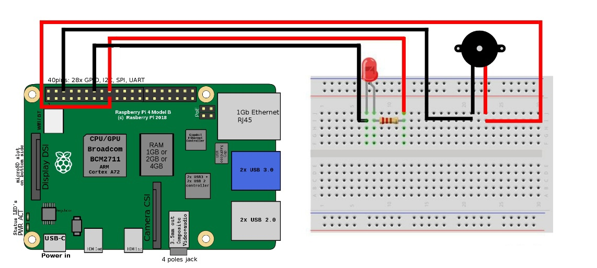
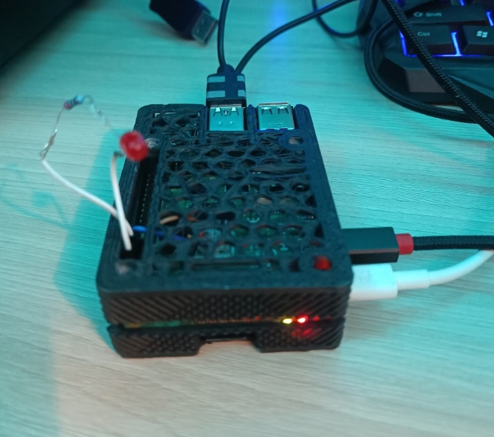
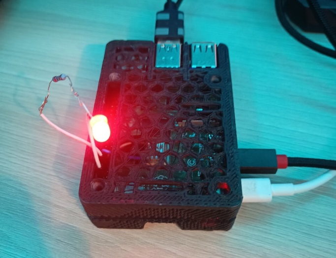
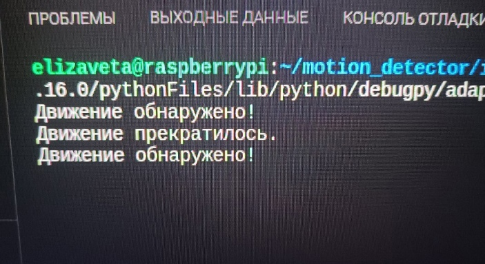

# Распознавание посторонних движений на Raspberry

Добро пожаловать в проект распознавания движения на Raspberry Pi 4! Этот проект позволяет вам настроить систему, для распознавания посторонних движений, которые препятсвуют свободному следованию подвижного состава, приближающихся транспортных средств.

## Оглавление
1. [Описание проекта](#описание-проекта)
2. [Инструкции по установке](#инструкции-по-установке)
   - [Установка эмулятора Raspberry Pi](#установка-эмулятора-raspberry-pi)
   - [Настройка Raspberry Pi](#настройка-raspberry-pi)
   - [Установка зависимостей](#установка-зависимостей)
3. [Подключение компонентов](#подключение-компонентов)
4. [Дополнительные материалы](#дополнительные-материалы)
   - [Демонстрация работы](#демонстрация-работы)
   - [Видео на YouTube](#видео-на-youtube)
6. [Лицензия](#лицензия)

## Описание проекта

Этот проект представляет собой систему, способную обнаруживать движение в посторонних движений. Когда движение обнаруживается, система активирует светодиод и пьезоизлучатель. Проект основан на Raspberry Pi и использует Python и библиотеку OpenCV, модель для обучения YOLOv3 для обработки изображений с подключенной камеры. В папку записываются картинки в какое время обнаружено движение.
## Инструкции по установке

Следуйте этим шагам, чтобы настроить проект на вашем компьютере.

### Установка эмулятора Raspberry Pi

Для начала установите эмулятор Raspberry Pi, чтобы можно было разрабатывать и тестировать проект на вашем компьютере. Вы можете найти подробные инструкции [здесь](https://losst.pro/emulyator-raspberry-pi-3) или [здесь](https://www.myraspberry.ru/emulyator-raspberry-pi-dlya-windows.html).

### Настройка Raspberry Pi

После установки эмулятора, следует настроить Raspberry Pi. Вам потребуется настроить конфигурацию GPIO для подключения светодиода и пьезоизлучателя. Вы можете найти подробные инструкции и схему подключения в файле [gpio_config.md](gpio_config.md). Схема для подключения, приведена на рисунках ниже.

### Установка зависимостей

Прежде чем запустить проект, убедитесь, что все необходимые зависимости установлены. Вы можете сделать это следующим образом:

1. Откройте терминал на вашем Raspberry Pi.

2. Перейдите в директорию проекта:
   ```bash
   cd rpi-motion-detection
3. Установите необходимые библиотеки: 
    ```bash
    pip install opencv-python
    pip install RPi.GPIO
    pip install numpy
4. Скачайте модель YOLO [здесь](https://drive.google.com/drive/folders/1B_mjPiJrn1OCpznu5lZEfC3ncC4UHcIl?usp=sharing)

## Подключение компонентов

Принципиальная схема подключения индикаторов на Raspberry Pi 4 представлена ниже. Свтодиод подключается на 18 пин через резистор 220 Ом, и на GND. Пьезо, подключается на 17 пин и GND. 








## Дополнительные материалы
### Демонстрация работы

#### Файл model.py запускаем на Raspberry Pi и наблюдаем демонстрацию проекта



### Видео на YouTube

Просмотреть как работает система можете [здесь](https://youtube.com/shorts/WABb_Oe7tLg?si=YpZfD50yzkKvh9e9)

